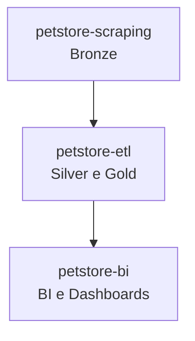

# 🐾 PetStore Pipeline

Projeto central de **análise e visualização de dados** do setor pet, integrando os repositórios:

* [`petstore-scraping`](https://github.com/rafa-trindade/petstore-scraping) → coleta de dados (Bronze)
* [`petstore-etl`](https://github.com/rafa-trindade/petstore-etl) → tratamento e enriquecimento (Silver e Gold)
* [`petstore-bi`](https://github.com/rafa-trindade/petstore-bi) → dashboards e análises (BI)

Este repositório serve como **hub do projeto**, documentando o fluxo de dados completo e fornecendo uma visão consolidada do pipeline.

---

## 📌 Objetivo

Demonstrar a **pipeline completa de dados** de franquias do setor pet, desde a coleta bruta até a visualização em dashboards interativos.

---

## 🧩 Fluxo de Dados

---

## 📊 Estrutura do Projeto Final

| Repositório | Função | Camada | Principais Tecnologias |
| ----------------- | ----------------------------- | ------------------ | -------------------------------------- |
| [`petstore-scraping`](https://github.com/rafa-trindade/petstore-scraping) | Coleta de Dados de Franquias | 🟤 Bronze | Selenium, BeautifulSoup4, lxml, pandas |
| [`petstore-etl`](https://github.com/rafa-trindade/petstore-etl) | Limpeza, Padronização e Carga | ⚪ Silver / 🟡 Gold | pandas, brazilcep, requests, Nominatim |
| [`petstore-bi`](https://github.com/rafa-trindade/petstore-etl) | BIo e Dashboards | 📊 BI | Streamlit, Plotly, pandas |

---

## 🏪 Redes Suportadas

Atualmente, os dados abrangem as seguintes redes:

* **Petz**
* **Cobasi**
* **Petlove**

---

## ⚙️ Tecnologias e Bibliotecas

O projeto utiliza um conjunto de ferramentas para automação, tratamento e análise de dados:

* **Python** → linguagem principal do pipeline
* **pandas** → manipulação de DataFrames
* **Selenium / BeautifulSoup4 / lxml** → scraping
* **brazilcep / Nominatim** → enriquecimento de dados geográficos
* **Streamlit / Plotly** → dashboards interativos

---

## 🖥️ Log de Execução

Cada etapa gera logs detalhados de execução:

* **petstore-scraping:** coleta de dados brutos
* **petstore-etl:** transformação e enriquecimento
* **petstore-bi:** geração de dashboards e gráficos

🔗 [log petstore-scraping](https://raw.githubusercontent.com/rafa-trindade/petstore-scraping/refs/heads/main/logs/log.txt)
🔗 [log petstore-etl](https://raw.githubusercontent.com/rafa-trindade/petstore-etl/refs/heads/main/logs/log.txt)

---

## 🔗 Organização do Portfólio

Este repositório serve como **apresentação do projeto**. Ele contém:

* Diagramas do pipeline
* Links para os repositórios individuais
* Screenshots e visualizações dos dashboards
* Descrição detalhada de cada camada da arquitetura de dados

---

## 📌 Conclusão

O `petstore-pipeline` demonstra uma **pipeline completa de dados**, do scraping à visualização, mostrando competências em:

* Engenharia de Dados
* ETL e Integração de Dados
* Business Intelligence e Dashboards
