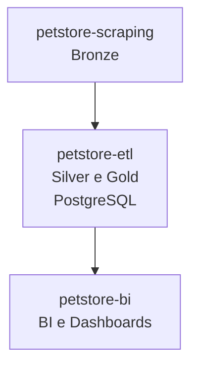

# 🐾 PetStore Pipeline

Este repositório serve como **hub do projeto**, documentando o fluxo de dados completo e fornecendo uma visão consolidada do pipeline.

* [`petstore-scraping`](https://github.com/rafa-trindade/petstore-scraping) → coleta de dados (Bronze)
* [`petstore-etl`](https://github.com/rafa-trindade/petstore-etl) → tratamento e enriquecimento (Silver e Gold)
* [`petstore-bi`](https://github.com/rafa-trindade/petstore-bi) → dashboards e análises (BI)

O `petstore-pipeline` demonstra uma **pipeline completa de dados**, do scraping à visualização, mostrando competências em:

* Engenharia de Dados
* ETL e Integração de Dados
* Business Intelligence

---

## 📌 Objetivo:

Demonstrar a **pipeline completa de dados** de franquias do setor pet, desde a coleta bruta até a visualização em dashboards interativos.

---

## 🧩 Fluxo de Dados:

---

## 📊 Estrutura Geral do Projeto:

| Repositório | Função | Camada | Principais Tecnologias |
| ----------------- | ----------------------------- | ------------------ | -------------------------------------- |
| [`petstore-scraping`](https://github.com/rafa-trindade/petstore-scraping) | Coleta de Dados de Franquias | 🟤 Bronze | Selenium, BeautifulSoup4, lxml, pandas |
| [`petstore-etl`](https://github.com/rafa-trindade/petstore-etl) | Limpeza, Padronização e Carga | ⚪ Silver / 🟡 Gold | requests, SQLAlchemy, pandas, Cep Aberto (API) |
| [`petstore-bi`](https://github.com/rafa-trindade/petstore-bi) | BI e Dashboards | 📊 BI | Streamlit, Plotly, pandas |

---

## 🏪 Redes Analisadas:

Atualmente, o projeto coleta dados públicos das seguintes redes para estudo:

* **Cobasi**
* **Pet Camp**
* **Petland**
* **Petlove**
* **Petz**
* **Pop Pet Center**

---

## ⚙️ Tecnologias e Bibliotecas:

O projeto utiliza um conjunto de ferramentas para automação, requisição, tratamento e análise de dados:

* [**pandas**](https://pypi.org/project/pandas/) → manipulação e estruturação de dados tabulares
* [**Selenium**](https://pypi.org/project/selenium/) → automação de navegação e interação com páginas dinâmicas  
* [**BeautifulSoup4**](https://pypi.org/project/beautifulsoup4/) → extração e análise de conteúdo HTML  
* [**lxml**](https://pypi.org/project/lxml/) → parser rápido e eficiente para HTML e XML
* [**requests**](https://pypi.org/project/requests/) → chamadas HTTP para APIs externas  
* [**tabulate**](https://pypi.org/project/tabulate/) → exibição de tabelas no terminal de forma legível  
* [**SQLAlchemy**](https://pypi.org/project/SQLAlchemy/) → conexão e manipulação de bancos de dados SQL de forma programática  
* [**psycopg2-binary**](https://pypi.org/project/psycopg2-binary/) → driver PostgreSQL para Python  
* [**python-dotenv**](https://pypi.org/project/python-dotenv/) → leitura de variáveis de ambiente a partir de arquivos `.env`
* [**plotly**](https://pypi.org/project/plotly/) → visualizações interativas
* [**streamlit**](https://pypi.org/project/streamlit/) → criação de dashboards web

O projeto utiliza a API **CEP Aberto** para obter informações de **latitude e longitude**, além de preencher campos ausentes de endereço (logradouro, bairro, cidade, estado, cep).
---

## 🖥️ Log de Execução:

Cada etapa gera logs detalhados de execução:

* **petstore-scraping:** coleta de dados brutos
* **petstore-etl:** transformação e enriquecimento
* **petstore-bi:** eda, tratamento de dados, análise e BI

🔗 [log petstore-scraping](https://raw.githubusercontent.com/rafa-trindade/petstore-scraping/refs/heads/main/logs/log.txt)
🔗 [log petstore-etl](https://raw.githubusercontent.com/rafa-trindade/petstore-etl/refs/heads/main/logs/log.txt)

---

## 🔗 Organização do Portfólio:

Este repositório serve como **apresentação do projeto**. Ele contém:

* Diagramas do Pipeline
* Links para os repositórios individuais
* Descrição detalhada de cada camada da arquitetura de dados

---

## 📸 Capturas de Tela

#### - Fitro Região

